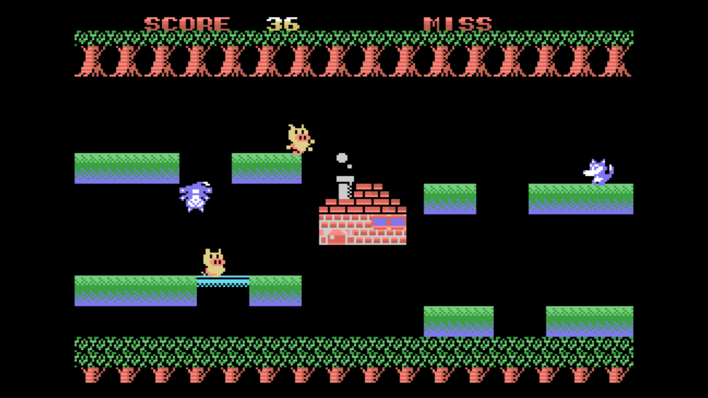

[ [Engligh](README.md) | [日本語](README_ja.md) ]

---

# MSX-KOBUTA RESCUE

## Overview

Written in MSX-BASIC.  
Let's send the little piggies home.  

## Requirements

- MSX/2/2+/TurboR

## Run in WebMSX

- Please access the following URL.

https://webmsx.org/?MACHINE=MSX1J&DISKA_URL=https://github.com/aburi6800/msx-KobutaRescue/raw/main/PenDisk.dsk&FAST_BOOT

## How to play

- Manipulate the floor to keep the piglet from falling into the hole and send it home.
- Drop the wolf in the hole to keep it out of house.
- A mistake is made if the piglet falls into a hole or the wolf reaches home.
- If you miss three times, the game is over.

## Controls

- Space Key / A Button : Game Start, move a floor

## Author

Hitoshi Iwai (aburi6800)  

## Licence

MIT License  
