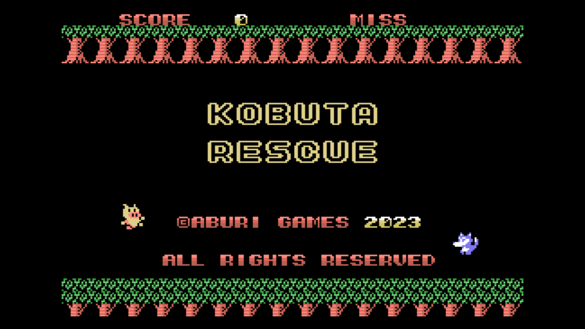

[ [Engligh](README.md) | [日本語](README_ja.md) ]

---

# MSX-KOBUTA RESCUE

## 概要

sMSX-BASICで書いています。  
子ブタたちを、家に帰してあげてください。  

## 動作要件

- MSX/2/2+/TurboR

## WebMSXで遊ぶ

- 以下のURLにアクセスしてください。

https://webmsx.org/?MACHINE=MSX1J&DISKA_URL=https://github.com/aburi6800/msx-KobutaRescue/raw/main/PenDisk.dsk&FAST_BOOT

## How to play

- 子ブタが穴に落ちないように床を操作して、家に帰しましょう。
- オオカミは、家に入れないように、穴に落としましょう。
- 子ブタが穴に落ちたり、オオカミが家にたどり着くと、ミスです。
- 3回ミスするとゲームオーバーです。

## 操作方法

- スペースキー / Aボタン : ゲームスタート、床移動

## 作者

Hitoshi Iwai (aburi6800)

## ライセンス

MIT License
